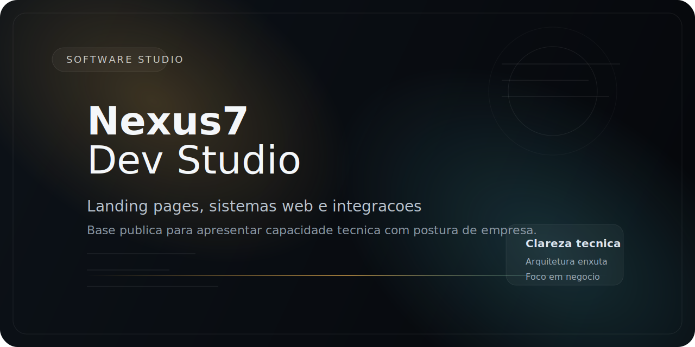

# Nexus7 Dev Studio

Estudio boutique de software para empresas que precisam de entrega tecnica clara, execucao responsavel e produtos digitais prontos para operar.

A Nexus7 Dev Studio organiza, projeta e implementa produtos digitais com foco em tres frentes: aquisicao de demanda, operacao interna e integracao entre sistemas. Trabalhamos de forma enxuta por escolha: menos camada comercial, mais contato direto com quem define arquitetura, escreve codigo e sustenta a entrega.

Este repositorio e a base publica da Nexus7. Aqui concentramos posicionamento, servicos, projetos publicados e estudos de caso para que um cliente entenda rapidamente como pensamos, como executamos e onde geramos valor.

## O que um cliente encontra aqui

- Posicionamento e proposta de valor da Nexus7.
- Servicos com escopo claro e aderencia a negocio.
- Projetos reais publicados pelos socios do estudio.
- Estrutura de documentacao pronta para receber novos cases sem virar bagunca.

## Como nos posicionamos

- Pequenos por escolha, tecnicos por default.
- Foco em software sob medida, nao em "fazemos tudo".
- Decisoes documentadas, escopo claro e arquitetura sustentavel.
- Relacao direta com quem entrega, sem ruido de repasse.

Mais contexto:

- [Posicionamento do estudio](docs/posicionamento.md)
- [Diagnostico estrategico e o que nao repetir da 404 Devs](docs/diagnostico-estrategico.md)
- [Arquitetura do repositorio](docs/arquitetura-do-repositorio.md)

## Servicos

- Landing pages e websites orientados a conversao.
- Sistemas web, paineis administrativos e ferramentas internas.
- APIs, integracoes e automacoes para fluxos operacionais.
- Evolucao tecnica, reestruturacao e sustentacao de produto.

Detalhamento completo:

- [Catalogo de servicos](services/README.md)

## Projetos publicados

### Centro de Estetica Katia Tiso

Landing page mobile-first para captacao de leads via WhatsApp e formulario, com base estatica modular e pronta para integracao.

- [Resumo do projeto](projects/centro-de-estetica-katia-tiso.md)
- [Estudo de caso](case-studies/centro-de-estetica-katia-tiso.md)
- [Repositorio publico](https://github.com/CristianoRFB/landing-page-clinica-estetica)

### Lan House Manager

Base de sistema cliente/servidor com operacao offline, regras de negocio por perfil e preparacao para painel administrativo centralizado.

- [Resumo do projeto](projects/lan-house-manager.md)
- [Estudo de caso](case-studies/lan-house-manager.md)
- [Repositorio publico](https://github.com/CristianoRFB/Lan-House)

## Como trabalhamos

1. Diagnostico do contexto, escopo e restricoes.
2. Definicao da arquitetura e do plano de entrega por fase.
3. Implementacao com clareza de stack, criterio tecnico e manutencao futura.
4. Validacao, publicacao e sustentacao com documentacao minima necessaria.

## Estrutura deste repositorio

```text
.
|-- assets/
|   `-- brand/
|-- case-studies/
|-- docs/
|-- projects/
`-- services/
```

- `docs/`: diagnostico, posicionamento, arquitetura editorial e melhorias.
- `services/`: forma de apresentar a oferta da Nexus7 sem linguagem generica.
- `projects/`: resumos executivos dos projetos publicados.
- `case-studies/`: versoes mais completas, com problema, solucao e decisoes tecnicas.
- `assets/`: identidade visual e elementos reutilizaveis do repositorio.

## O que nao vamos fazer para parecer profissionais

- Depoimento ficticio.
- Numero inventado.
- Stack inflada sem relacao com a entrega.
- Design chamativo sem explicar valor de negocio.
- Case sem contexto, solucao e decisao tecnica.

## Proximo passo

Se a sua empresa precisa tirar um produto do papel, organizar uma base tecnica existente ou publicar uma entrega digital com mais clareza, a Nexus7 Dev Studio pode estruturar o projeto com escopo objetivo e execucao direta.

Canais comerciais oficiais devem ser vinculados aqui antes da divulgacao ampla do repositorio:

- GitHub: [Nexus7-DevStudio](https://github.com/Nexus7-DevStudio)
- Fiverr: `adicionar perfil oficial`
- 99Freelas: `adicionar perfil oficial`
- E-mail comercial: `adicionar canal oficial`
